VMWare10安装黑苹果环境
========================

[上一节](# "无") &nbsp;&nbsp;&nbsp;&nbsp;&nbsp;&nbsp;&nbsp;&nbsp;
[个人主页](http://a272121742.github.io) &nbsp;&nbsp;&nbsp;&nbsp;&nbsp;&nbsp;&nbsp;&nbsp;
[首页](../index.md) &nbsp;&nbsp;&nbsp;&nbsp;&nbsp;&nbsp;&nbsp;&nbsp;
[下一节](./2.VMWare10安装黑苹果过程.md) &nbsp;&nbsp;&nbsp;&nbsp;&nbsp;&nbsp;&nbsp;&nbsp;

# 安装前简介

黑苹果之所以称之为“黑苹果”，是相对于他不是安装在苹果机上的系统。而通常黑苹果又有两种安装模式，一种虚拟机安装，一种整机安装。现在给大家介绍的就是虚拟机安装，因为这种安装模式比较简单，而且可以实现双系统互联。虚拟机安装又分为VirtualBox安装和VMware安装，这里选用微软的VMWare安装是因为他安装之后，能更好的和本机连接。

# 安装前知识

我们将采用Windows上安装黑苹果为例子，此时安装的黑苹果我们称之为“客机”——Guest，相对我们所使用的Windows机器称之为“宿主机”——Host。目前，我采用的宿主机是Win8.1系统，其他Windows系统只要不是太老按照道理也是可以的。机器的性能要求至少I5以上，内存怎么的也要4G以上。相比之下，我的电脑给黑苹果分配了4G内存仍然会有些卡顿。

另外我们在选择VMWare和黑苹果的版本上有点特殊，基于以下几点：

VMware选择workstation 10，或者player 6，前者是功能更加完善，而后者是更加轻便。个人比较倾向后者，但本次演示采用的是前者。当然需要注册码，自己百度一下咯。

黑苹果选择10.9的Mavericks版本，这个版本相对10.8来说有一些用户体验的改进。例如：鼠标滚轴的滑动不再是逆向的，而是跟Windows和Linux一样的滑动顺序了。再就是改进了一些Bug，安装一些软件的时候不至于出错。但是10.9刚出来不久，所以有些已经破解过的软件还不太能安装成功。不过我们都不太依赖上面的软件，只是抱着学习的心态试用一下Mac。而且今后的开发我们还会讲到如何跟Windows平台协作开发，提升效率。

# 安装前准备

0.  VMware workstation 10 或 VMware player 6，本教程选用的前者，以后简称`VM`。
0.  MacOS X 10.9安装镜像，我选择的是别人提取好的ISO，你也可选用原版自行提取。
0.  VM Mac 补丁，选择120之后的版本，如果不打补丁，则VM上没有安装Mac的选项。

# 环境准备流程

##  安装VM

可以[点击这里][vm_download]下载VM，解压后点击安装，进入安装画面：

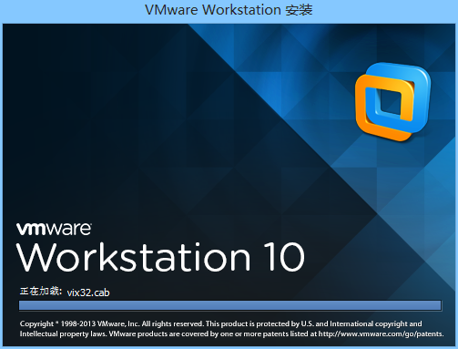

进入安装向导：

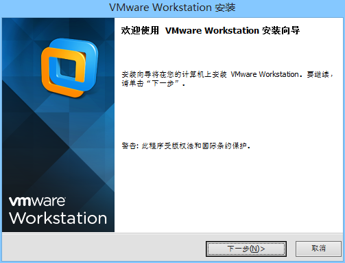

选择接受许可：

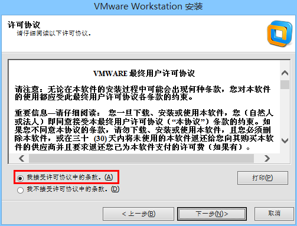

选择安装类型，可根据自己情况选择，这里我选择典型安装：

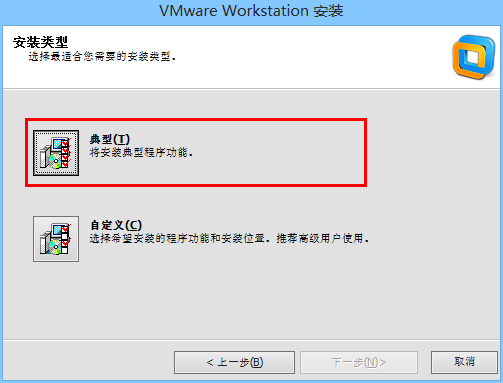

选择安装路径，注意，**请使用默认路径，否则补丁工具破解不了**：

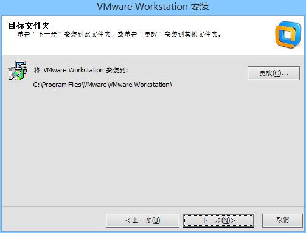

是否启用更新，我很讨厌微软的服务，所以我不启用：

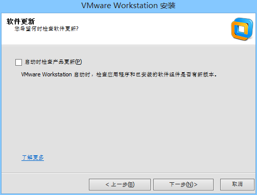

是否加入用户体验改进计划：

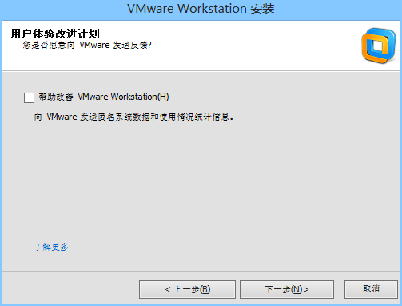

创建快捷方式：

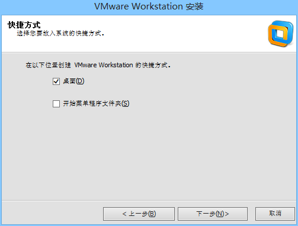

准备好所有的操作，点击继续：

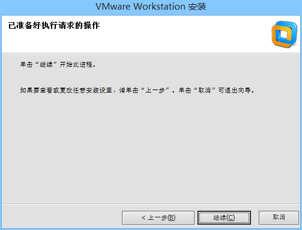

正在安装，安装时间很长，不喜欢的可以安装player版本，非常精简：

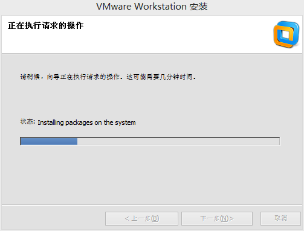

安装完毕后，输入密钥，可以百度到，这里提供永久密钥如图：

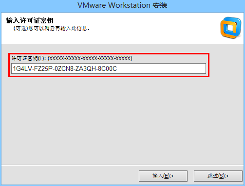

安装顺利完成：

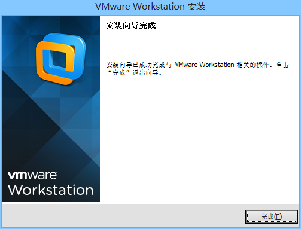

密钥输入完成后，VM就已经安装并且授权完毕

##  破解VM

此时安装时安装完成了，但是请不要现在立刻启动它，我们还需要破解它。因为默认情况下VM隐藏了开启苹果系统的选项，所以需要[VM的补丁][vm_plugs]才能启用。打开任务管理器，在进程中，将所有以“VMware”开头的进程全部杀掉。

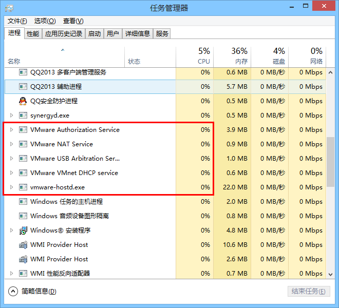

杀干净之后，打开我们已经下载好的VM补丁，注意版本必须是120之后的版本，否则你只能安装10.8而不能安装10.9。VM补丁解压之后显示的名称是“unlock-all-v120”，里面有个windows文件夹，进入之后，**以右键管理员身份运行**“install.cmd”批处理文件：

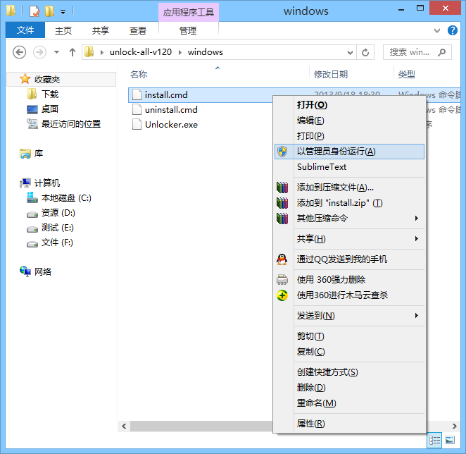

破解过程自动找VM的安装目录然后打补丁，安装完后命令行窗口会自动关闭：

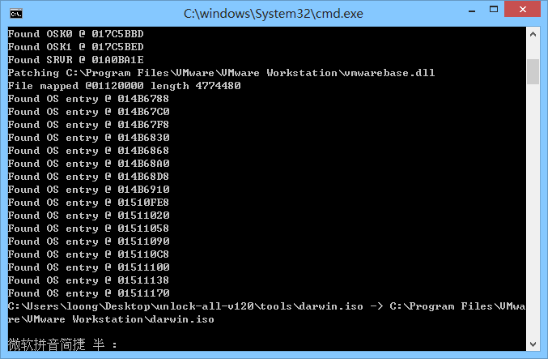

至此，所有的安装过程就全部结束，但是还没有完。请各位耐心的将电脑重启，接着，你就能进入安装虚拟机黑苹果的步骤了。

[vm_download]:http://www.xp510.com/xiazai/ossoft/desktools/22610.html "VMware Workstation(虚拟机)v10.0.1 简体中文破解版"
[vm_plugs]:http://www.liangchan.net/liangchan/4773.html "vmware unlocker for os x v1.2.0最新版"

[上一节](# "无") &nbsp;&nbsp;&nbsp;&nbsp;&nbsp;&nbsp;&nbsp;&nbsp;
[个人主页](http://a272121742.github.io) &nbsp;&nbsp;&nbsp;&nbsp;&nbsp;&nbsp;&nbsp;&nbsp;
[首页](../index.md) &nbsp;&nbsp;&nbsp;&nbsp;&nbsp;&nbsp;&nbsp;&nbsp;
[下一节](./2.VMWare10安装黑苹果过程.md) &nbsp;&nbsp;&nbsp;&nbsp;&nbsp;&nbsp;&nbsp;&nbsp;

