安装MongoDB
===========

[上一节](./3.建立共享.md) &nbsp;&nbsp;&nbsp;&nbsp;&nbsp;&nbsp;&nbsp;&nbsp;
[个人主页](http://a272121742.github.io) &nbsp;&nbsp;&nbsp;&nbsp;&nbsp;&nbsp;&nbsp;&nbsp;
[首页](../index.md) &nbsp;&nbsp;&nbsp;&nbsp;&nbsp;&nbsp;&nbsp;&nbsp;
[下一节](./5.安装RockMongo.md) &nbsp;&nbsp;&nbsp;&nbsp;&nbsp;&nbsp;&nbsp;&nbsp;


# 插件安装

##  HomeBrew简介

在Linux中有`apt-get`(ubuntu)或者`yum`(centos)来作为系统软件的安装管理器，他们的好处在于自动化管理软件及其依赖，安装便捷。在Mac中，HomeBrew就是这样一个非常不错的软件。当然还有MacPorts，这里不做比较合叙述，有需要的朋友自行学习。

##  HomeBrew安装

进入[HomeBrew主页][homebrew]，不难知道怎么安装：

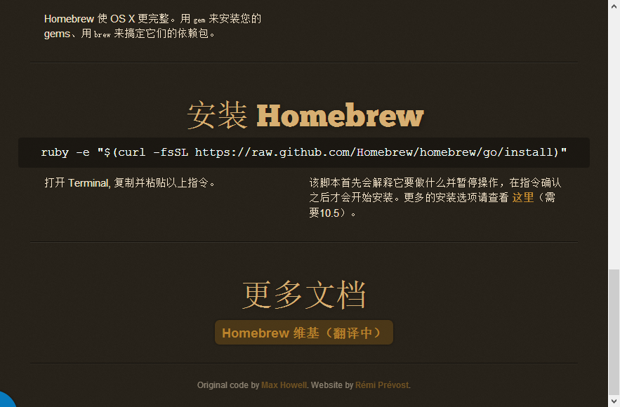

##  brew安装软件

同样，安装完后，参阅[HomeBrew主页][homebrew]也教你如何利用`brew`安装其他软件：

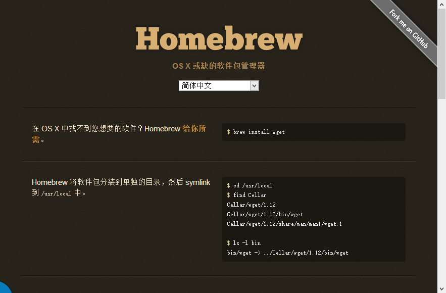

以安装`MongoDB`为例，是需要命令行：

```
$ brew search mongodb     #先查询是否有mongodb
$ brew install mongodb    #执行安装
```

安装完的软件都放在`/usr/local`中，并且还做好了版本管理，非常方便。包括权限、数据库目录，他都会帮助你配置完成，非常方便简单，适合懒人使用。

# 手工安装

## 下载

如果使用浏览器下载，首先使用Safari浏览器登录[MongoDB主页][mongodb]，点击下载按钮：

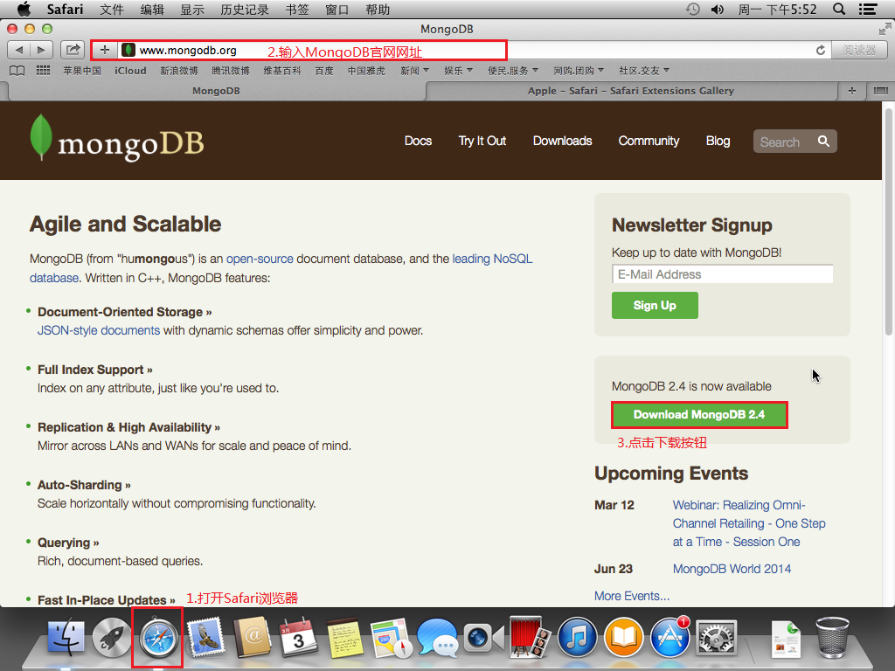

然后选择MacOS版本下载，这里我们选择64位：

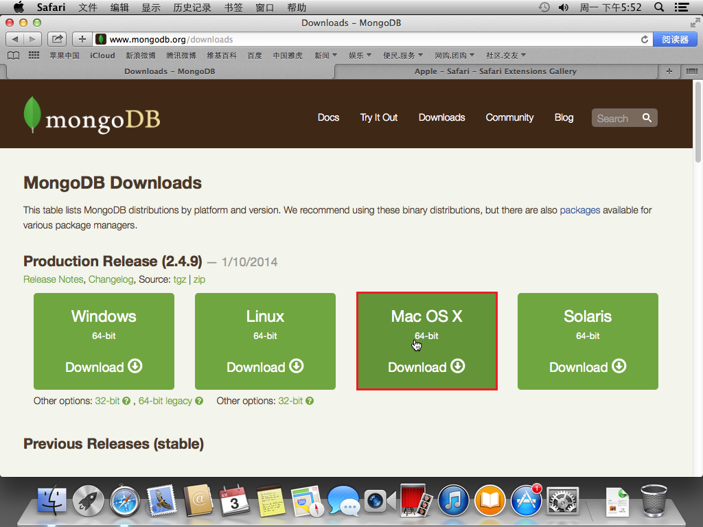

如果你偏爱命令行，就使用Mac中的终端命令下载：

```
curl -O http://downloads.mongodb.org/osx/mongodb-osx-x86_64-2.4.9.tgz
```

`x.x.x`填写你需要的版本号，注意选择好64或32位系统。

注意：

1. 命令最后可以使用`> mongodb.tgz`重命名。

2. 下载的位置取决于你在命令行的工作目录，建议是在`~/Download`目录下。

所谓的“命令行工作目录”指的是你目前通过命令行已经进入的文件夹目录，完整代码：

```
cd ~/Download
curl -O http://downloads.mongodb.org/osx/mongodb-osx-x86_64-2.4.9.tgz > mongodb.tgz
```

如图所示：

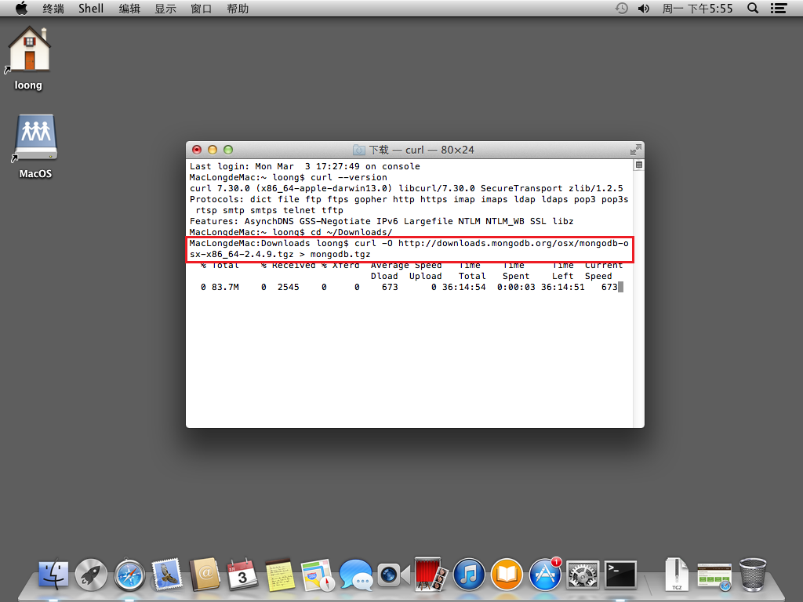

## 解压安装

### 解压

使用`tar`命令解压`tgz`文件，其他类型格式百度参考。

```
tar -zxvf mongodb.tgz
```
如图所示：

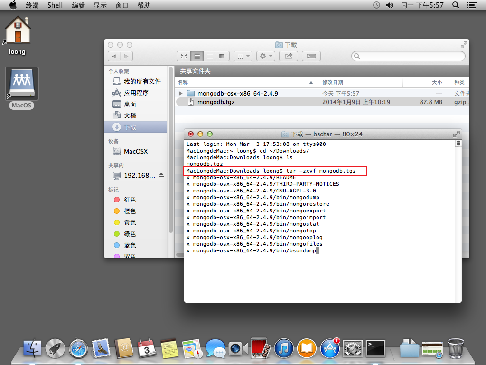

### 移动到安装目录

一般软件都应该安装在`/usr/local/`下：

```
sudo mv mongodb /usr/local/
```
如果没有这个目录，可以手动新建，如图：

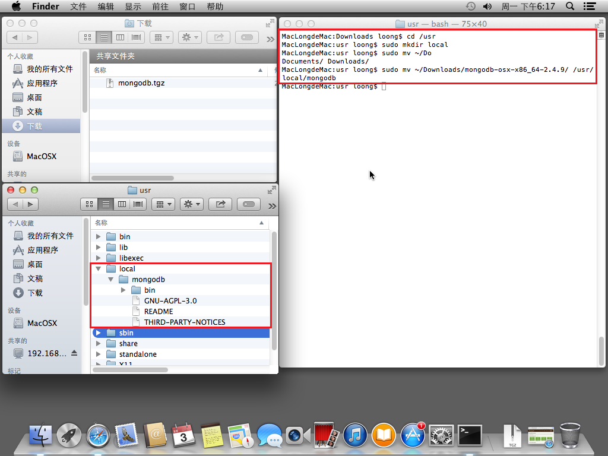

### 创建数据存储空间

这个官方固定存储空间，MongoDB启动时不会自动创建的。创建后还要设置权限。

```
mkdir -p /data/db
chown `id -u` /data/db
```

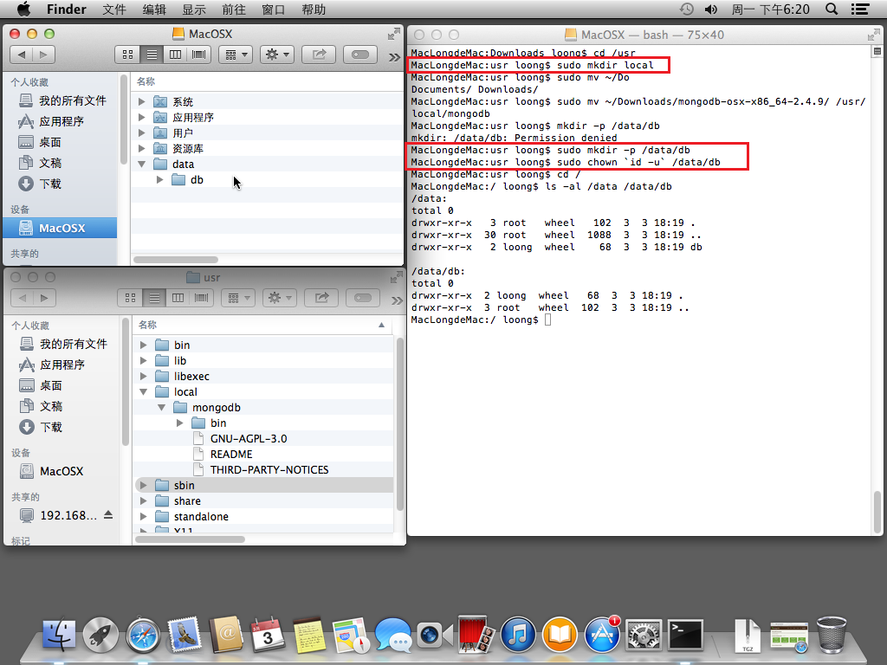

### 配置MongoDB参数

保存以下配置到`/usr/local/mongodb/mongod.conf`：

```
dbpath = /data/db
#默认指定本机IP
#bind_ip = 127.0.0.1
```
如图所示：

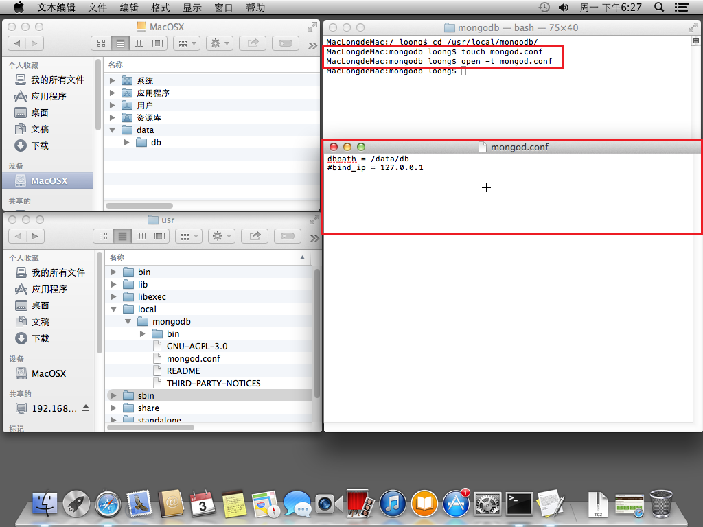

### PATH环境

将MongoDB二进制文件分配到PATH环境变量中：

```
cd ~/Desktop
touch .bash_profile
open -t .bash_profile
```

编辑为如下信息保存：

```
export PATH=/usr/local/mongodb/bin:$PATH
```

为了能让Meteor共享这个数据库，可以追加环境变量：

```
export MONGO_URL=//127.0.0.1:27017
```

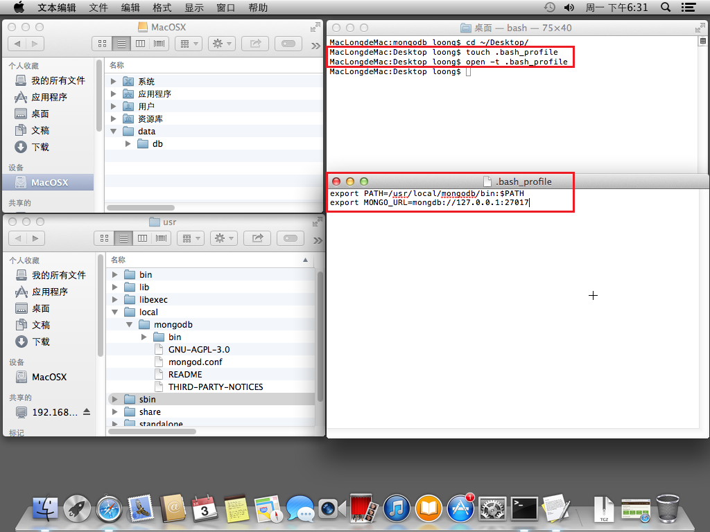

保存后复制到用户home目录：

```
sudo cp .bash_profile ~/
```

如果希望立刻就能使用MongoDB的命令，要么重启电脑，但是最好的办法就是让配置立即生效：

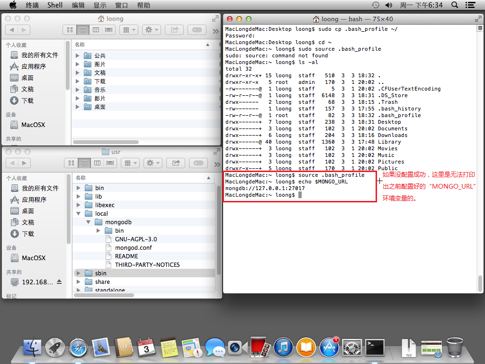

生效后，我们就可以使用`mongod`命令启动数据库服务，然后不能关闭这个咱挂的命令行。新开一个命令行然后运行`mongo`命令，我们就能进入数据库进行命令行的操作了：

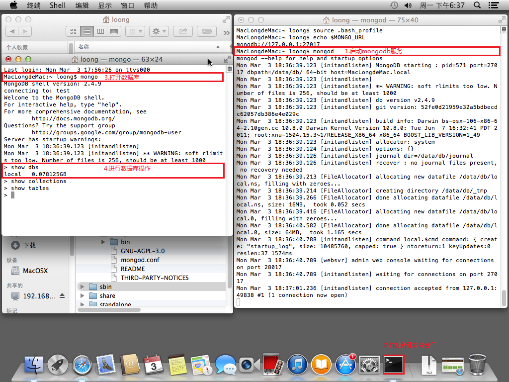

# 开机自启动

如果是使用`Homebrew`安装的MongoDB，他会生成一个自启动配置文件。

```
brew info mongodb         #查询安装的mongodb，能反馈出安装路径
ls 安装路径               #找到.plist文件
```

如果是自己手动安装，创建文件`org.mongodb.mongod.plist`：

```
<?xml version="1.0" encoding="UTF-8"?>  
<!DOCTYPE plist PUBLIC "-//Apple//DTD PLIST 1.0//EN" "http://www.apple.com/DTDs/PropertyList-1.0.dtd">  
<plist version="1.0">  
<dict>  
  <key>Label</key>  
  <string>org.mongodb.mongod</string>  
  <key>ProgramArguments</key>  
  <array>  
    <string>/usr/local/mongodb/bin/mongod</string>  
    <string>run</string>  
    <string>--config</string>  
    <string>/usr/local/mongodb/mongod.conf</string>  
  </array>  
  <key>RunAtLoad</key>  
  <true/>  
  <key>KeepAlive</key>  
  <true/>  
  <key>WorkingDirectory</key>  
  <string>/usr/local/mongodb</string>  
  <key>StandardErrorPath</key>  
  <string>/var/log/mongodb/output.log</string>  
  <key>StandardOutPath</key>  
  <string>/var/log/mongodb/output.log</string>  
</dict>  
</plist>  
```

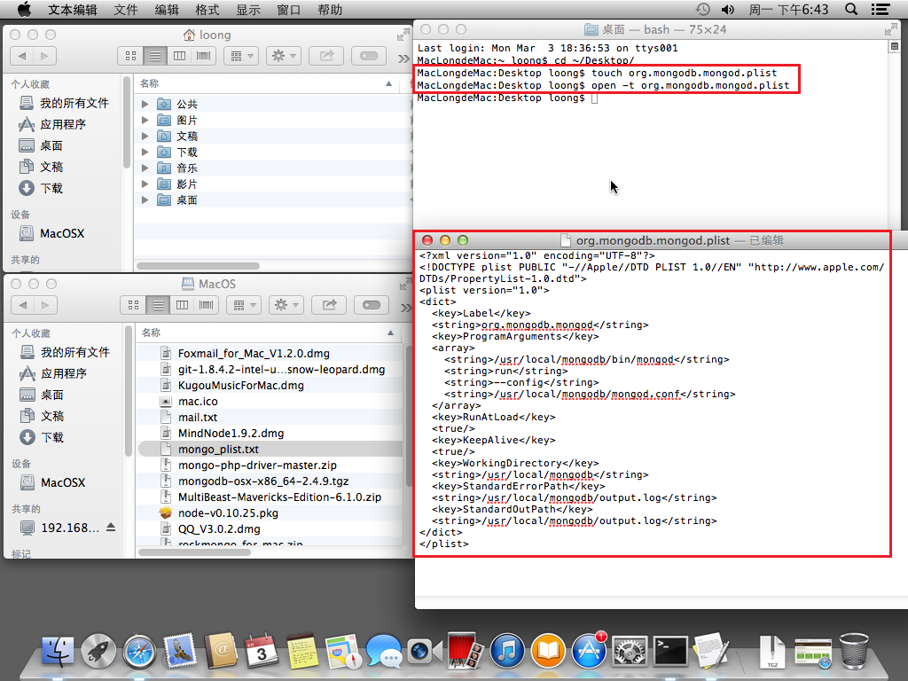

得到这个自启动配置文件后，我们就是要将他复制到`/Library/LaunchDaemons/`目录下，然后设置启动：

```
sudo cp org.mongodb.mongod /Library/LaunchDaemons/
sudo launchctl load /Library/LaunchDaemons/org.mongodb.mongod.plist
```

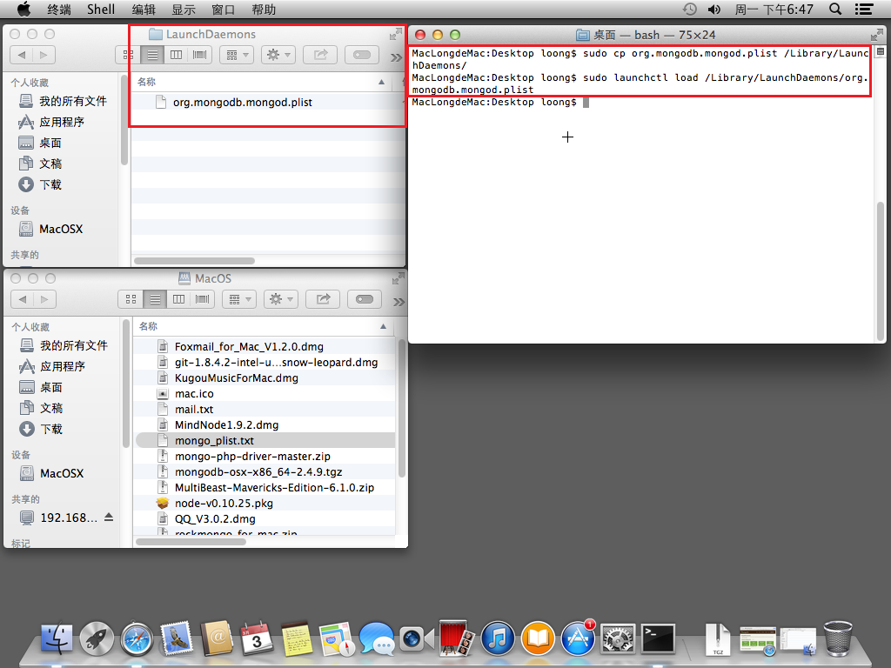

然后重启电脑，就可以使用`mongo`命令进如MongoDBShell了：

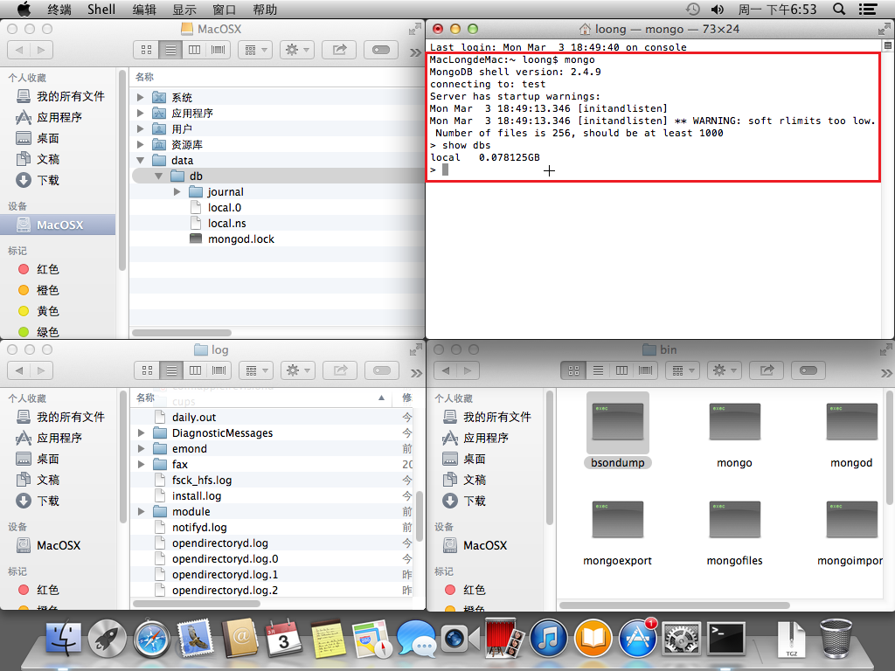

[homebrew]:http://brew.sh/index_zh-cn.html

[mongodb]:http://www.mongodb.org

[上一节](./3.建立共享.md) &nbsp;&nbsp;&nbsp;&nbsp;&nbsp;&nbsp;&nbsp;&nbsp;
[个人主页](http://a272121742.github.io) &nbsp;&nbsp;&nbsp;&nbsp;&nbsp;&nbsp;&nbsp;&nbsp;
[首页](../index.md) &nbsp;&nbsp;&nbsp;&nbsp;&nbsp;&nbsp;&nbsp;&nbsp;
[下一节](./5.安装RockMongo.md) &nbsp;&nbsp;&nbsp;&nbsp;&nbsp;&nbsp;&nbsp;&nbsp;
