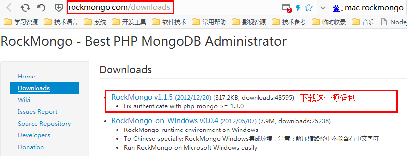
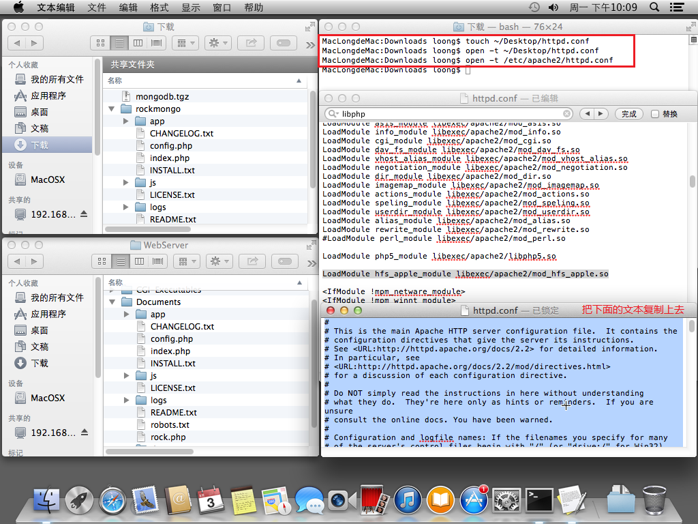
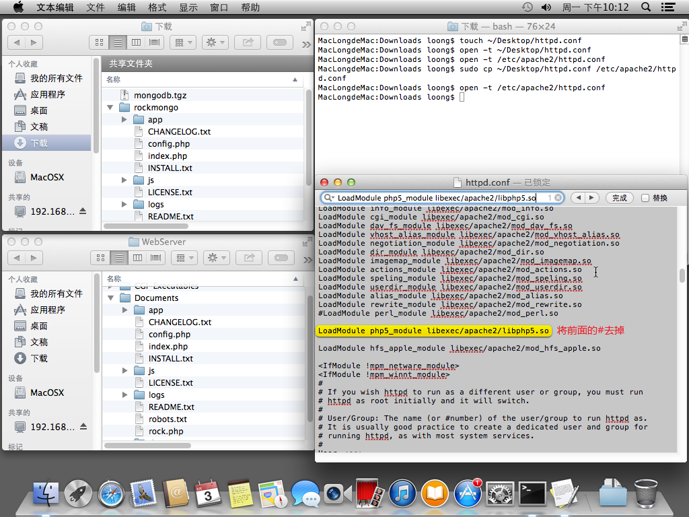
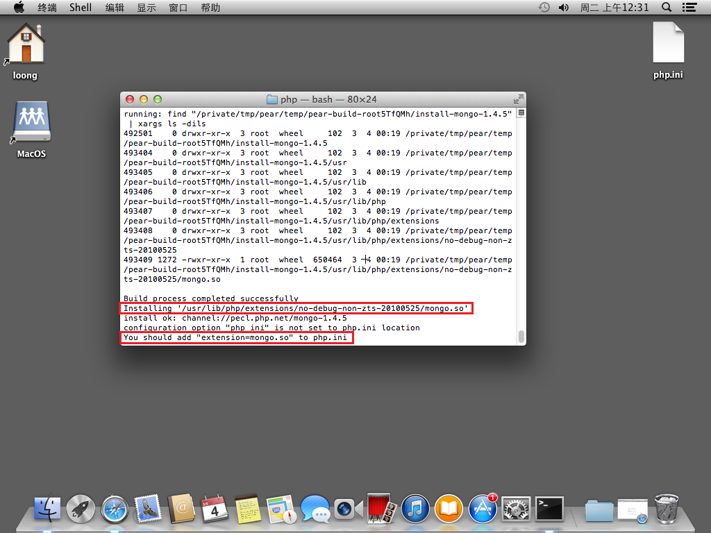
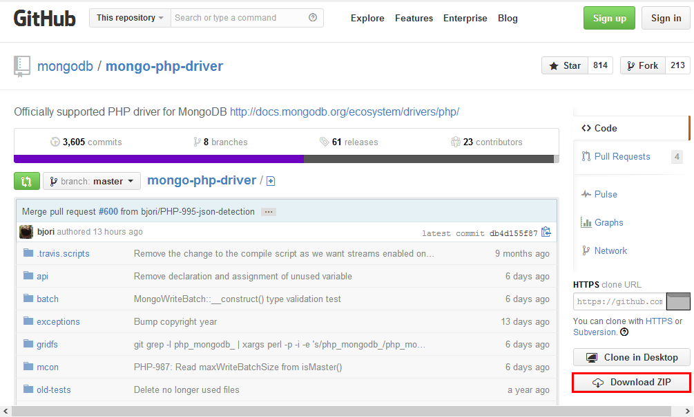
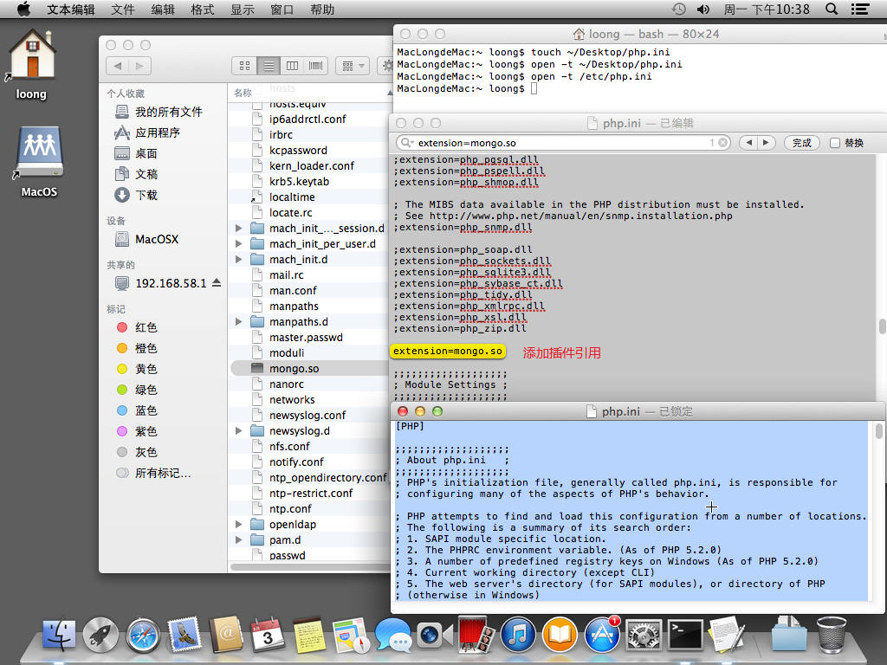
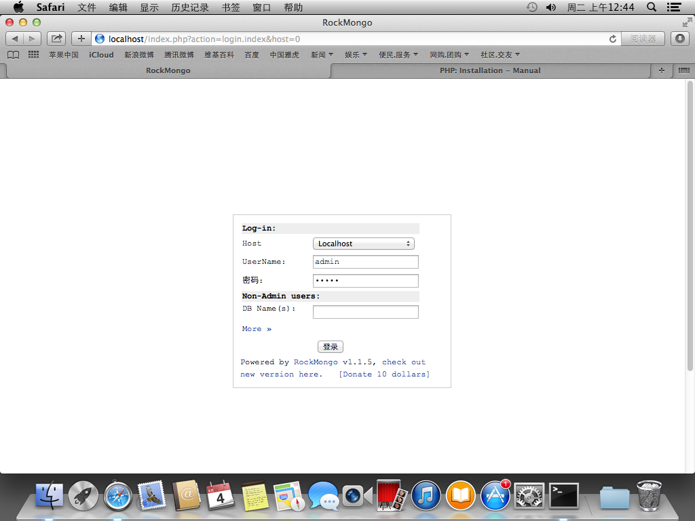

安装RockMongo
=============

如果已经安装好了MongoDB，接着就是要去使用他。相比大家都不太喜欢命令行，由此数据库的GUI就诞生了。MongoDB有很多GUI可视化工具，但是我比较偏向RockMongo，因为他是基于PHP网页的。网页的最大优势就是跨平台，只要用户名密码正确并且有权限，就能连接到任何地方的MongoDB，而无论系统是什么。RockMongo在Windows上解压即可用，内置了nginx和php。但是在Mac上安装，还是需要废一点点的周折的，虽然Mac已经内置了php。

# 下载RockMongo

用浏览器打开[下载地址](http://rockmongo.com/downloads)，下载源码包：



如果你希望在Windows机上连接苹果的MongoDB，就下载下面Windows版本，配置好IP地址即可访问，详情见RockMongo的帮助文档。

# 解压安装

这里下载的是`zip`文件，因此要用`unzip`命令解压：

```
$ unzip rockmongo-1.1.5.zip
```

解压之后得到一个文件夹，我们将这个文件夹里的内容都拷贝到php根目录下，移动之前可以删除根目录的其他内容（如果你有其他php项目，则按照php项目管理规范存放和配置）：

```
$ sudo rm -rfR /Libary/WebServer/Documents/*
$ sudo cp -R rockmongo/ /Libary/WebServer/Documents/
```

如图所示：


接着，我们要修改apache服务器的配置，让他能识别php。修改`/etc/apache2/httpd.conf`，将`#loadModule php5_module libexec/apache2/libphp5.so`前面的注释符号`#`去掉即可。此时会遇到权限问题，我们在桌面新建同名文件，然后打开这个配置目录，将内容复制进来，最后再将桌面的文件复制到apache2目录下即可：

```
$ touch ~/Desktop/httpd.conf
$ open -t ~/Desktop/httpd.conf
$ open -t /etc/apache2/httpd.conf
```

如图所示：



复制修改完后，进行复制覆盖：

```
$ sudo cp ~/Desktop/httpd.conf /etc/apache2/httpd.conf
```

如图所示：



接着我们将`/etc/php.ini.default`复制为`/etc/php.ini`：

```
$ sudo cp /etc/php.ini.default /etc/php.ini
```

到此，RockMongo是安装完成了，但是PHP并不认识MongoDB，需要PHP中连接MongoDB的插件。此插件是需要编译的，最快的方式是让php自动完成，先安装`pear`：

```
$ cd /usr/lib/php
$ sudo php install-pear-nozlib.phar
```

然后修改`php.ini`，将`include_path = ".:/php/includes"`修改为`include_path = ".:/usr/lib/php/pear"`并解除注释，接下来执行更新：

```
$ sudo pear channel-update pear.php.net
$ sudo pecl channel-update pecl.php.net
$ sudo pear upgrade-all
```

最后安装php的mongo驱动插件：

```
$ sudo pecl install mongo
```



根据最后的提示，拷贝`mongo.so`文件到`/etc`目录下：

```
$ sudo cp /usr/lib/php/extensions/no-debug-non-zts-20100525/mongo.so /etc/mongo.so
```

当然这种成功率很高，另外还有一种办法是进行手工编译，方法如下：

```
## 安装m4
$ curl -O http://mirrors.kernel.org/gnu/m4/m4-latest.tar.gz 
$ tar -zxvf m4-latest.tar.gz
$ cd m4-latest
$ ./configure -prefix=/usr/local
$ make
$ sudo make install

## 安装autoconf
$ curl -O http://mirrors.kernel.org/gnu/autoconf/autoconf-latest.tar.gz
$ tar -zxvf autoconf-latest.tar.gz
$ cd autoconf-latest
$ ./configure -prefix=/usr/local
$ make
$ sudo make install
```

再去Github上下载[mongo-php-driver](https://github.com/mongodb/mongo-php-driver):



然后按照网站上的教程，进行编译：

```
$ cd mongo-php-driver-master
$ phpize
$ ./configure
$ make
$ sudo make install
```

现在，我们将php的MongoDB插件`mongo.so`丢到`/etc`目录中并修改启动文件`php.ini`，添加`extension=mongo.so`即可（权限问题参考上面的）：



此时，就已经全部完成了，最后重启apache服务器。

```
$ sudo apachectl restart
## 如果没有重启就执行 sudo apachectl start来启动
```

打开浏览器输入`localhost`即可看到我们的RockMongo：



输入账号密码都是“admin”即可登录进去。自此，我们的RockMongo安装完毕。关于RockMongo的其他配置选项，参阅他的文档即可。

