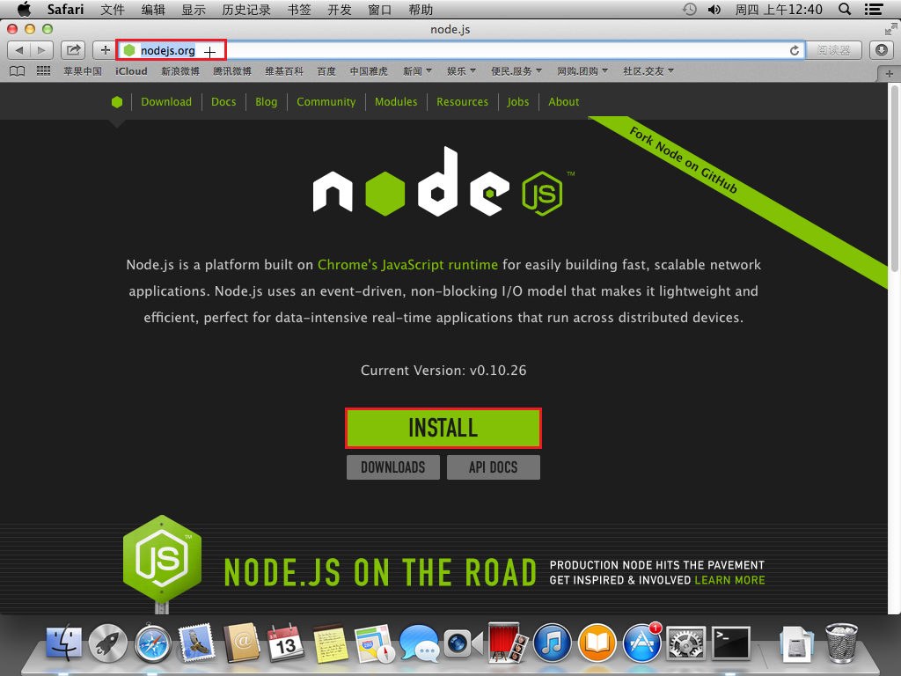
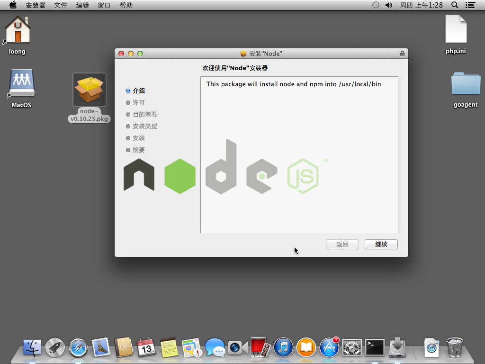
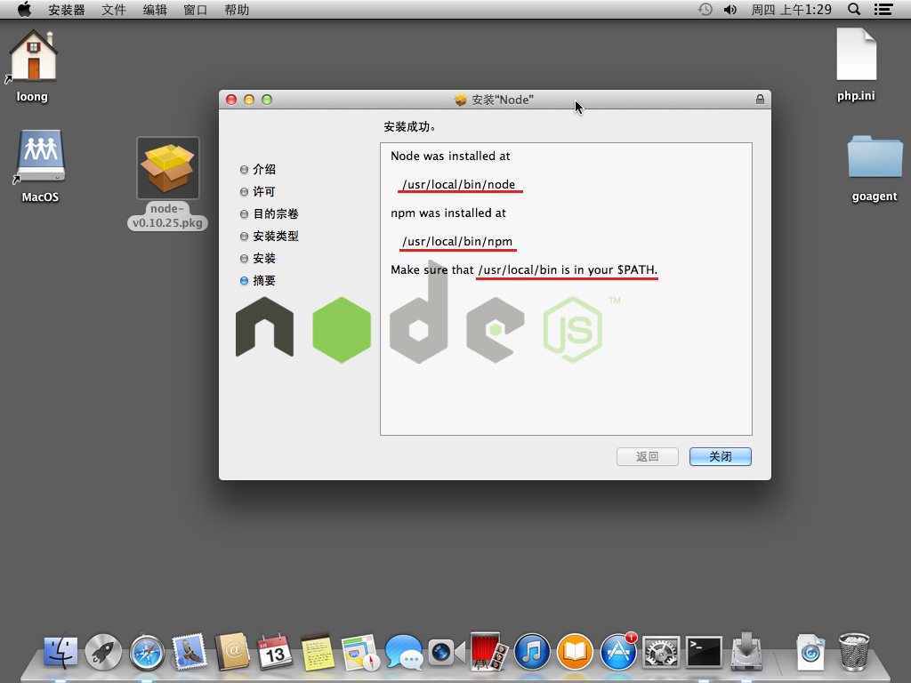
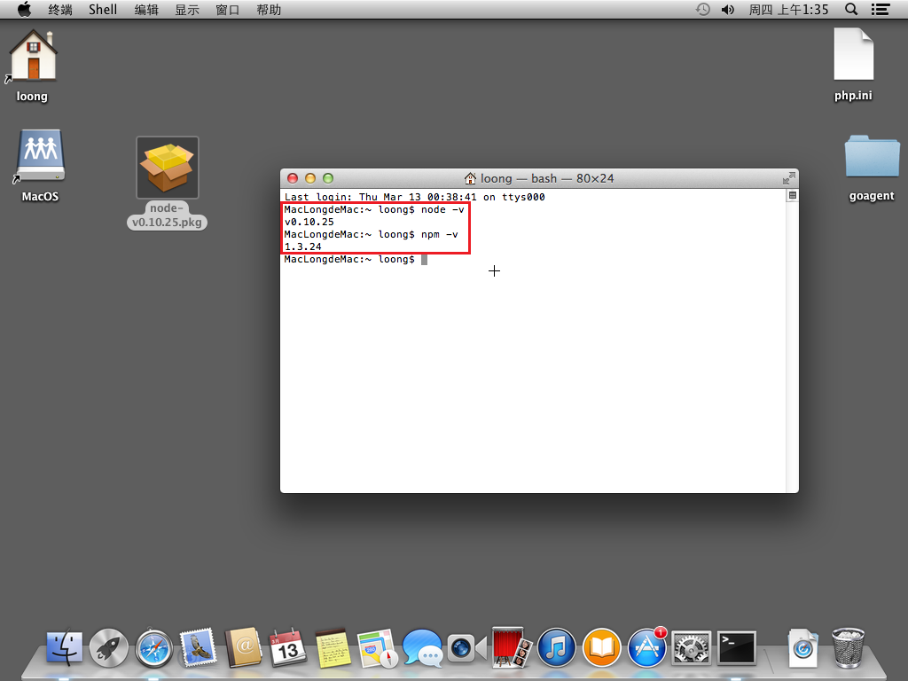

安装NodeJS
==========

[上一节](./5.安装RockMongo.md) &nbsp;&nbsp;&nbsp;&nbsp;&nbsp;&nbsp;&nbsp;&nbsp;
[个人主页](http://a272121742.github.io) &nbsp;&nbsp;&nbsp;&nbsp;&nbsp;&nbsp;&nbsp;&nbsp;
[首页](../index.md) &nbsp;&nbsp;&nbsp;&nbsp;&nbsp;&nbsp;&nbsp;&nbsp;
[下一节](./7.安装Meteor.md) &nbsp;&nbsp;&nbsp;&nbsp;&nbsp;&nbsp;&nbsp;&nbsp;

# 下载安装包

访问NodeJS官网，点击下载按钮下载安装包：

系统会自动判断主机环境，下载Mac下可用的`pkg`文件。

# 安装

双击`pkg`文件进行安装，一直点击继续即可：

安装完成后会提示你安装的目录（Node以及npm），并提示已经加入`PATH`环境：

最后打开命令行，我们查看是否正确安装完成：

[上一节](./5.安装RockMongo.md) &nbsp;&nbsp;&nbsp;&nbsp;&nbsp;&nbsp;&nbsp;&nbsp;
[个人主页](http://a272121742.github.io) &nbsp;&nbsp;&nbsp;&nbsp;&nbsp;&nbsp;&nbsp;&nbsp;
[首页](../index.md) &nbsp;&nbsp;&nbsp;&nbsp;&nbsp;&nbsp;&nbsp;&nbsp;
[下一节](./7.安装Meteor.md) &nbsp;&nbsp;&nbsp;&nbsp;&nbsp;&nbsp;&nbsp;&nbsp;
