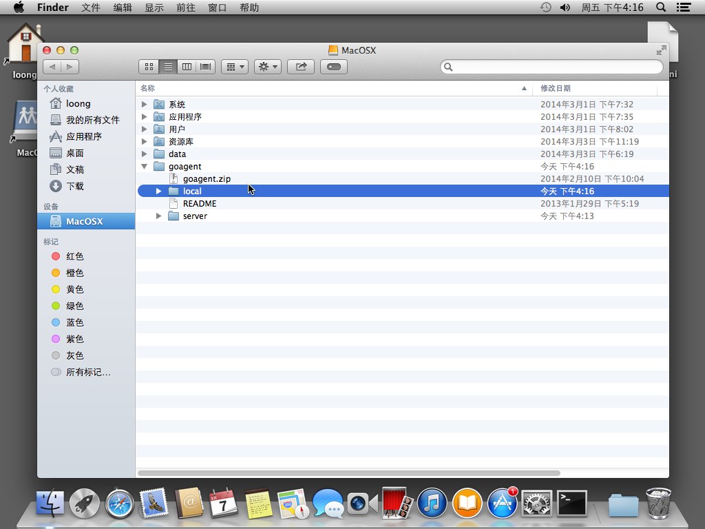
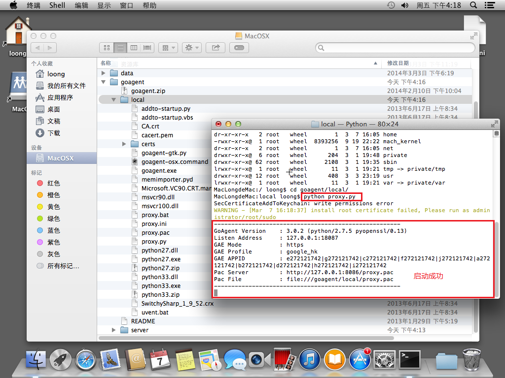
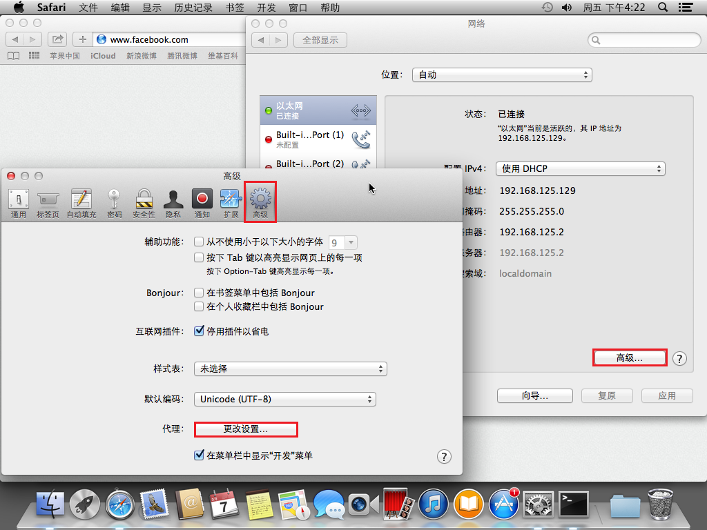
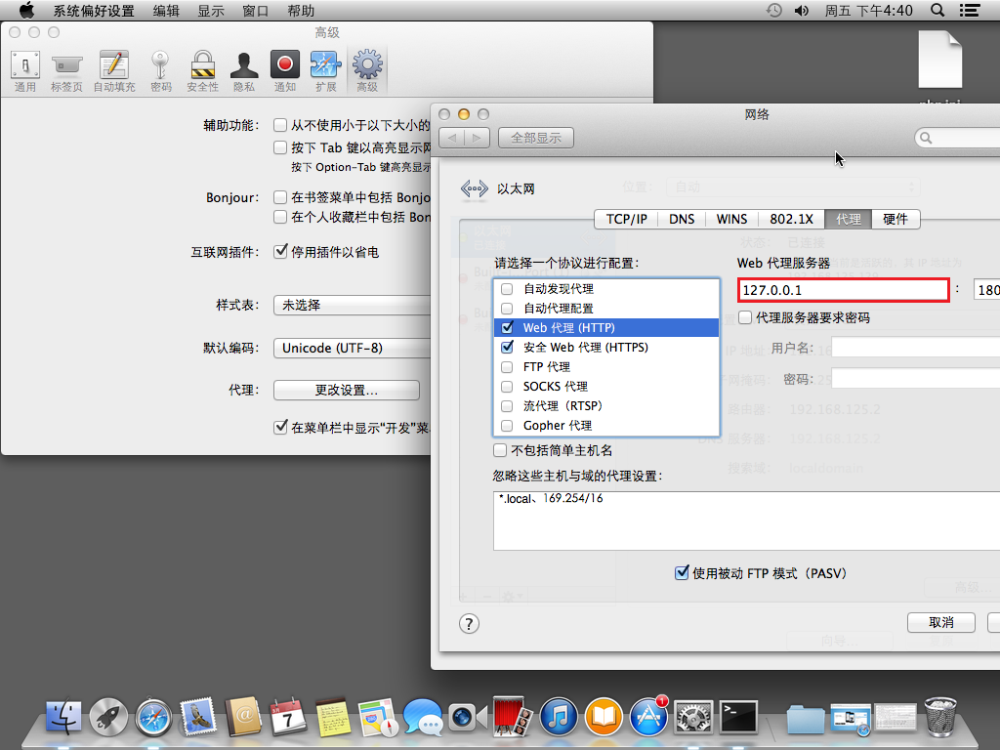
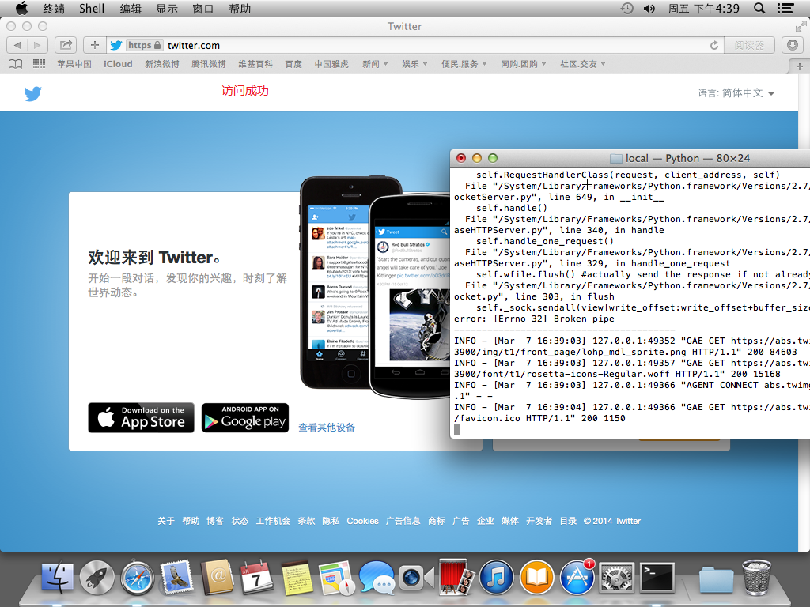
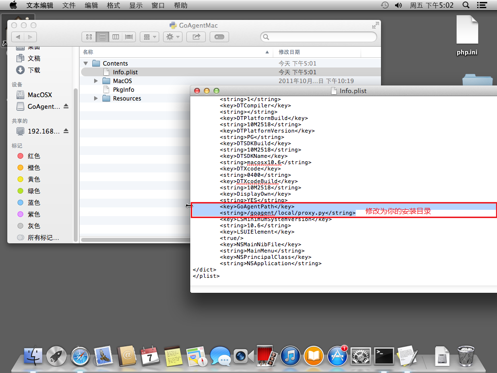
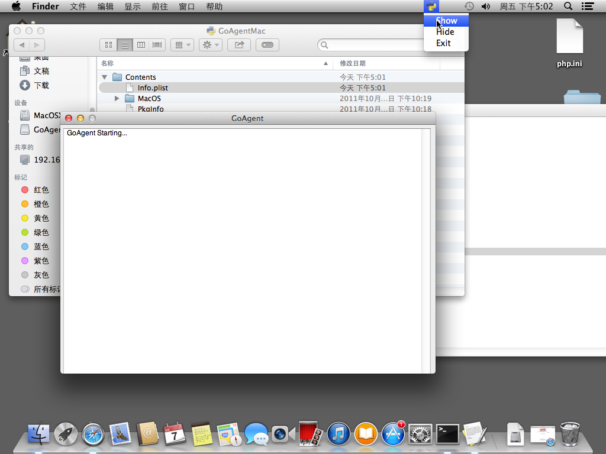
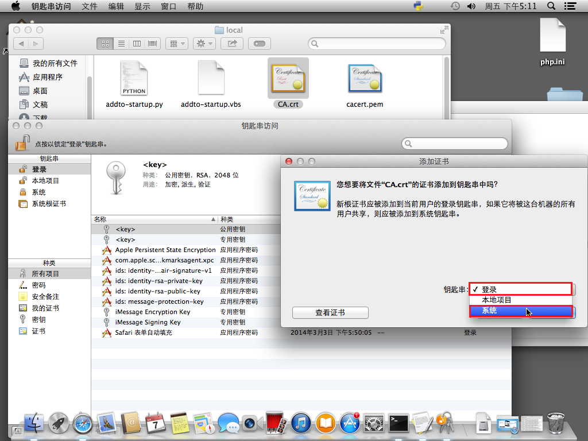
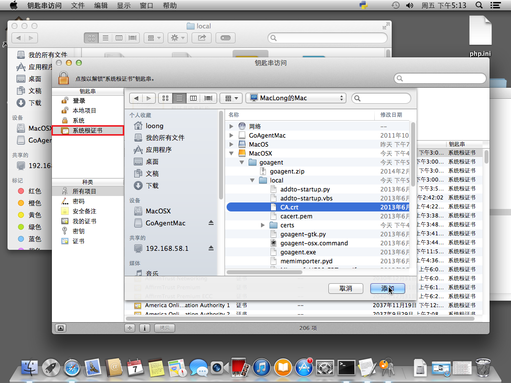

Mac翻墙教程
============

[上一节](./选修1：修改屏幕分辨率.md) &nbsp;&nbsp;&nbsp;&nbsp;&nbsp;&nbsp;&nbsp;&nbsp;
[个人主页](http://a272121742.github.io) &nbsp;&nbsp;&nbsp;&nbsp;&nbsp;&nbsp;&nbsp;&nbsp;
[首页](../index.md) &nbsp;&nbsp;&nbsp;&nbsp;&nbsp;&nbsp;&nbsp;&nbsp;
[下一节](# "无") &nbsp;&nbsp;&nbsp;&nbsp;&nbsp;&nbsp;&nbsp;&nbsp;

今天给大家介绍在Mac上如何安装翻墙工具。我们都知道，我国基于信息文字的传播有很多禁令，因此像Facebook、Twitter这样的社交网站是无法访问的。如果想要登录这样的网站，就需要通过翻墙工具来实现。

在Windows平台上比较熟悉的翻墙工具是Google的`goagent`，以下简称`GAE`。关于GAE的安装和配置，我不做过多的讲解，网站有很多这样的教程。如果大家还是不清楚，有机会我将编写Windows下的安装教程。

这里我们假定你在Windows上已经翻墙成功，只是现在希望Mac上也能翻墙。如果局域网还有一台Windows机，那么当然你可以通过局域网安装有GAE的Windows机代理翻墙。但这并不是我们要讲的重点，而是如何只在Mac中也安装GAE。

# 安装

因为我们已经有“你在Windows上翻墙成功”的前提，所以，我们要做的就是把GAE移动到Mac上即可。整个GAE既然已经在Windows上安装完成，那么移动时，配置是跟着走的，你都不需要重新去弄这些。

我们将GAE整个文件夹移动到`/`根目录下，或者你喜欢什么位置你就移动吧：

然后我们打开命令行，找到GAE目录下的local目录。输入`python proxy.py`即可：

运行可能需要root权限，怎么弄你懂的。

# 设置

但此时，我们仍然无法访问Facebook、Twitter等国外信息网站。因为我们还没有给浏览器做配置。这里我们简单阐述Safari的配置（火狐和Chrome网上有很多的）。在“Safari偏好设置”里，点击“高级”选项卡，找到“代理”选项，点击“更改设置”。或者在“系统设置”里找到“网络”，在当前连接网络中找到“高级设置”，点击进去后选择“代理”选项卡：

将`Web代理(HTTP)`和`安全Web代理(HTTPS)`都勾选，并设置代理地址为你GAE配置文件已经配置的地址端口，以我的配置为例子：

配置完成就可以访问需要翻墙才能访问的网站了：

如果不希望翻墙了，就将网络代理配置取消即可。

# 快捷程序

你当然不希望每次都这样大费周章的去用命令行，并且来回确认或取消代理操作。这里，我们将使用一个工具来封装以上操作。

百度`goagent dmg`，下载之后安装。在应用程序中找到`GoAgentMac`，右键“显示包内容”。

找到`Contents`文件夹下的`Info.plist`文件，打开修改`GoAgentPath`的内容为你的GAE的安装目录下的`proxy.py`完整地址：

然后我们运行这个应用程序，咋一看没啥反应。在右上角看见那个熟悉的GAE图标然后点击`show`我们就能看到显示了。这里，他只显示已经启动，只要输入网站，看能否翻墙成功就知道配置是否成功了。

但是设置或取消翻墙还是要通过之前复杂的操作，如果希望简化操作，可是使用`Chrome浏览器`并使用`SwitchSharp`插件。

# 证书

翻墙还需要注意的是，不是所有需要翻墙的网站都能翻墙，需要证书的。在GAE的local目录下，就有`CA.crt`。双击之后安装在“登录”和“系统”项：

最后在“系统根证书”这里也手动添加一个证书即可：

到此，你就可以翻墙无困扰了。

[上一节](./选修1：修改屏幕分辨率.md) &nbsp;&nbsp;&nbsp;&nbsp;&nbsp;&nbsp;&nbsp;&nbsp;
[个人主页](http://a272121742.github.io) &nbsp;&nbsp;&nbsp;&nbsp;&nbsp;&nbsp;&nbsp;&nbsp;
[首页](../index.md) &nbsp;&nbsp;&nbsp;&nbsp;&nbsp;&nbsp;&nbsp;&nbsp;
[下一节](# "无") &nbsp;&nbsp;&nbsp;&nbsp;&nbsp;&nbsp;&nbsp;&nbsp;